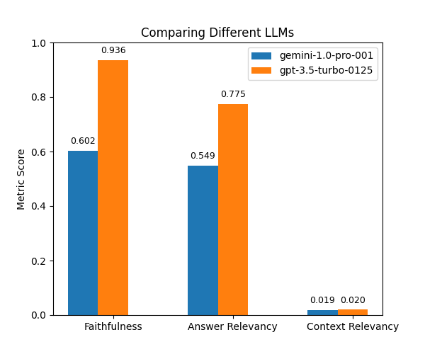

# siosio-rag
This open-source project demonstrates Retrieval Augmented Generation (RAG) using Large Language Models (LLMs).

## Overview
**siosio-rag** uses the following technologies:
* **Orchestration:** LangChain.
* **Embedding Vectorstore:** Weaviate.
* **Text Embeddings:** FlagEmbedding.
* **LLMs:** OpenAI ChatGPT and Google Gemini.
* **Evaluation:** Ragas.

**Reference**:
[chat-langchain](https://github.com/langchain-ai/chat-langchain/tree/master)

## Getting Started

### Prerequisites

- `Python` (version 3.10 or higher)
- `PyTorch` (version 2.1.2 or higher)

Once you have these dependencies installed, clone this repository and set up the environment:

### Installation

#### Clone the repository

```bash
git clone https://github.com/your-username/siosio-rag.git
```

#### Install dependencies
```bash
pip install -r requirements.txt
```

## Usage

### Prepare Data
Run `prepare_data.py` to preprocess and save the data:

```bash
python prepare_data.py --out_path out_directory_path
```

### Build Index for Retrieval
Run `build_index.py` to convert data into embeddings and build an index:

```bash
python build_index.py --input_path data_directory_path --out_path out_directory_path --index_name name_for_index
```

### Perform RAG
Run `rag.py` to execute RAG:

```bash
python rag.py \
    --input_path csv_path \
    --output_path out_directory_path \
    --index_path index_path \
    --index_name index_name \
    --model_name llm_model_name \
    --api_key api_key_for_llm
```

### Evaluation (Optional)
Run `evaluate.py` to evaluate the RAG results:

```bash
python evaluate.py \
    --input_path result_csv_path \
    --output_path out_directory_path \
    --api_key api_key_for_llm
```

## Results



**Note**:
1. Data used in the experiment can be found [here](https://drive.google.com/file/d/1-1323eYPg5YxKgyrX9vNPRniJeWPbYs7/view?usp=sharing).
2. The results were obtained with `Ragas` v1.7.
3. For information about the metrics, please refer to this [doc](https://docs.ragas.io/en/stable/concepts/metrics/index.html).

## License
This project is licensed under the MIT license. Please refer to the LICENSE file for details.